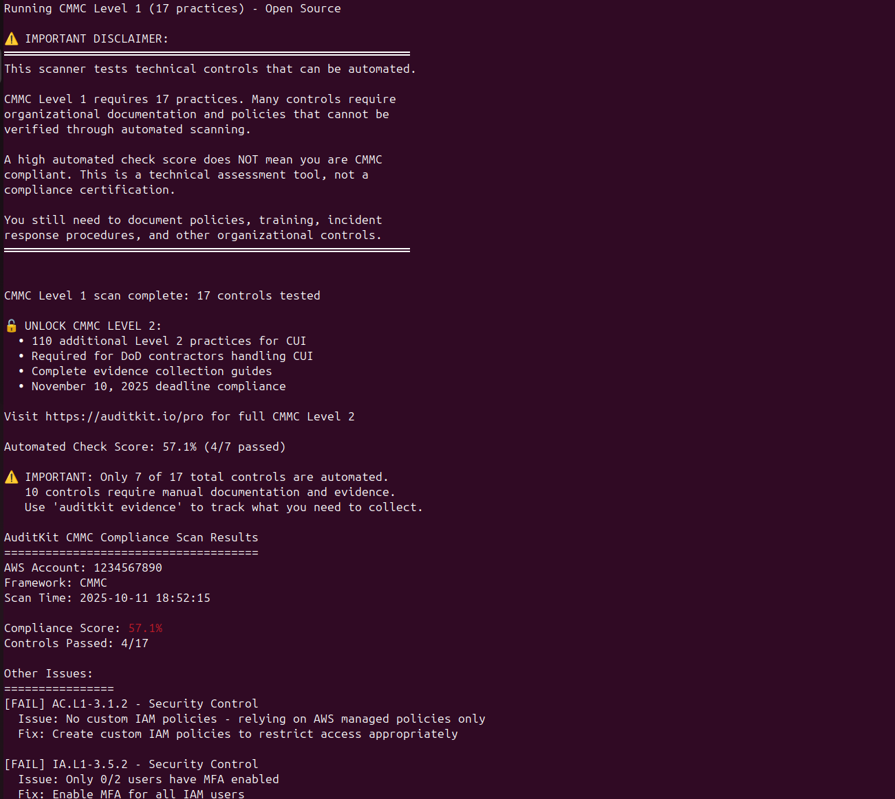
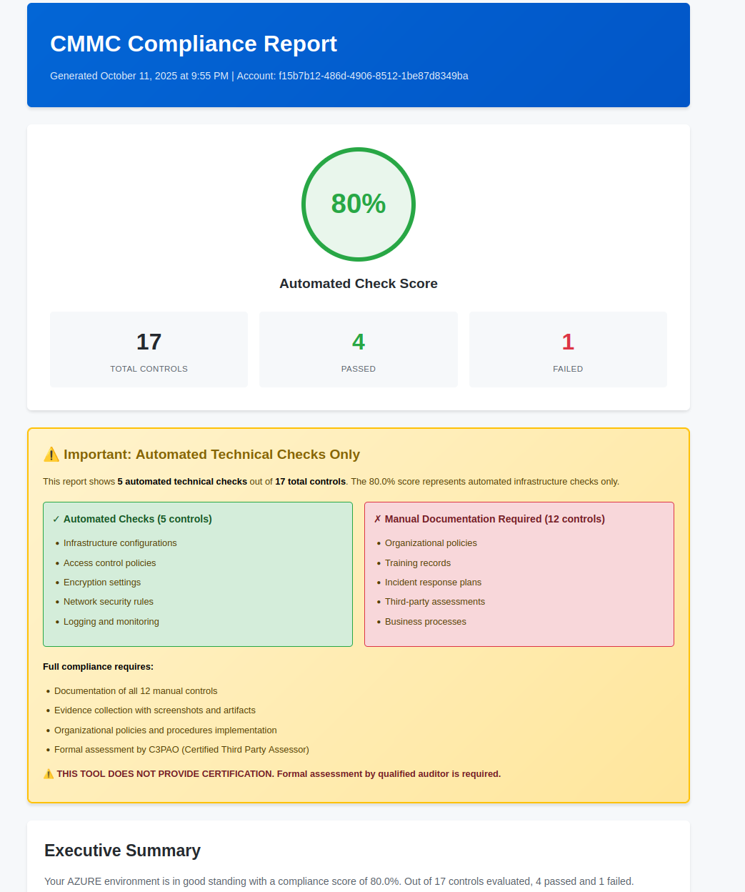
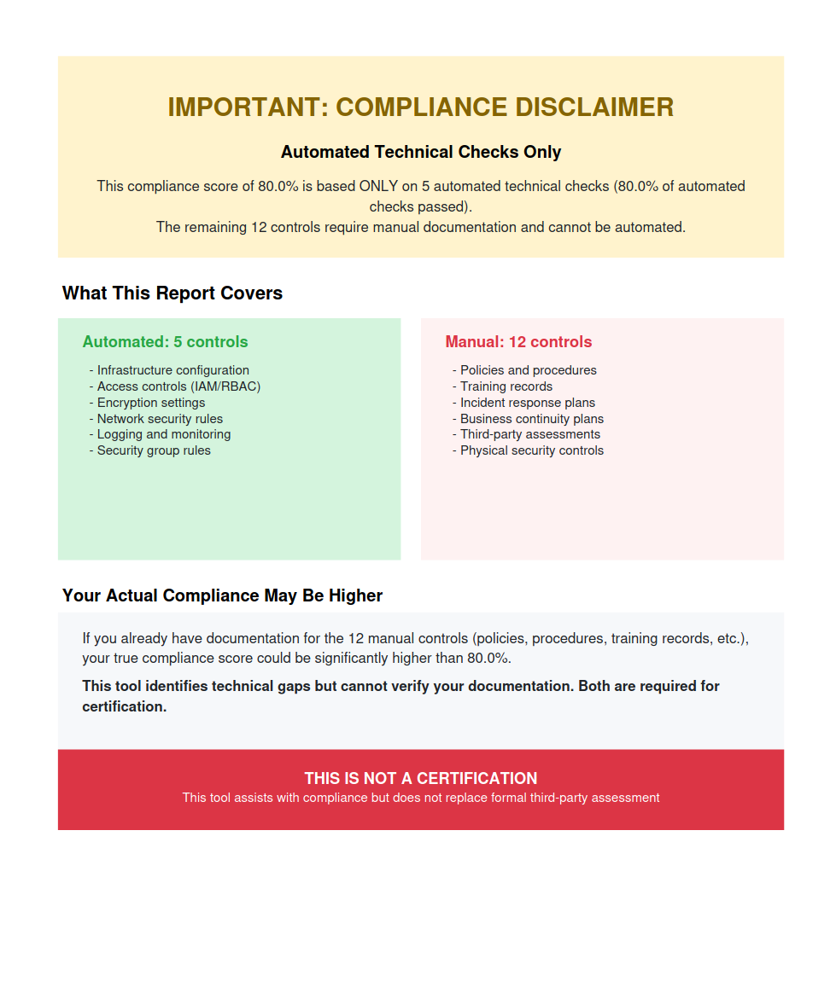
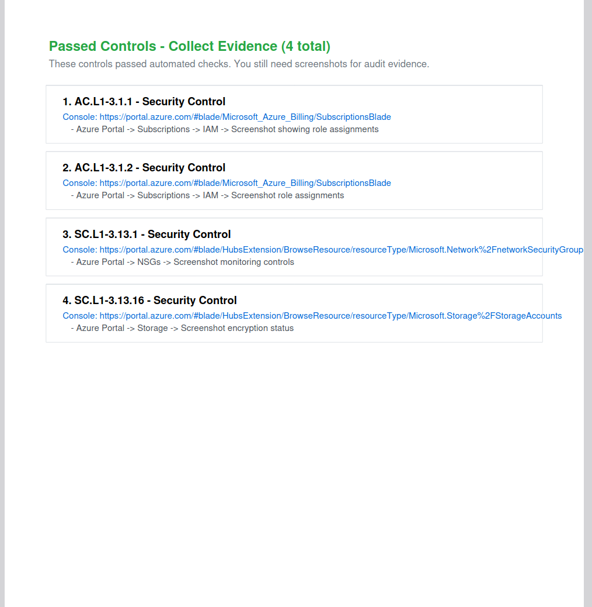

# AuditKit - Open-Source Compliance Scanner

**Scan AWS, Azure, and M365 for SOC2, PCI-DSS, HIPAA, CMMC, and NIST 800-53 compliance. Get audit-ready reports in minutes.**

[](https://github.com/guardian-nexus/auditkit/stargazers)
[](https://opensource.org/licenses/Apache-2.0)
[](https://github.com/guardian-nexus/auditkit/releases)
[](https://auditkit.substack.com)
---

## Quick Start

```bash
# Install
git clone https://github.com/guardian-nexus/auditkit
cd auditkit/scanner
go build ./cmd/auditkit

# Scan AWS for SOC2
aws configure
./auditkit scan -provider aws -framework soc2

# Generate PDF report
./auditkit scan -provider aws -framework soc2 -format pdf -output report.pdf
```

**That's it.** You'll get a compliance score and list of what needs fixing.

---

## What It Does

AuditKit automates the **technical controls** for compliance audits:

- Scans your cloud infrastructure (AWS, Azure, M365)
- Checks ~150 automated controls per framework
- Shows exact CLI commands to fix issues
- Generates PDF/HTML reports auditors understand
- Tracks your progress over time

**What it doesn't do:** Replace your auditor, scan for vulnerabilities, or handle organizational policies.

---

## Examples and Sample Reports

### Terminal Output

Here's what you see when running AuditKit against your cloud environment:



### HTML Report Preview

Interactive HTML reports with compliance scores, automated vs manual check breakdowns, and evidence collection guides:







### Available Sample Reports

**AWS Compliance Reports:**
- [AWS SOC2 Report (PDF)](./docs/examples/reports/sample-aws-soc2-report.pdf)
- [AWS SOC2 Report (HTML)](https://guardian-nexus.github.io/auditkit/examples/reports/sample-aws-soc2-report.html)
- [AWS PCI-DSS Report (PDF)](./docs/examples/reports/sample-aws-pci-report.pdf)
- [AWS CMMC Report (PDF)](./docs/examples/reports/sample-aws-cmmc-report.pdf)

**Azure Compliance Reports:**
- [Azure CMMC Report (PDF)](./docs/examples/reports/sample-azure-cmmc-report.pdf)
- [Azure CMMC Report (HTML)](https://guardian-nexus.github.io/auditkit/examples/reports/sample-azure-cmmc-report.html)

[View all examples](./docs/examples/)

---

## Supported Frameworks

| Framework | AWS | Azure | M365 | Status |
|-----------|-----|-------|------|--------|
| **SOC2** | 64 controls | 64 controls | 100+ rules | Production |
| **PCI-DSS v4.0** | 30 controls | 30 controls | Mapped | Production |
| **CMMC Level 1** | 17 practices | 17 practices | Mapped | Production |
| **NIST 800-53 Rev 5** | ~150 controls | ~150 controls | Mapped | **NEW** |
| **HIPAA** | ~10 controls | ~10 controls | Basic | Experimental |
| **CMMC Level 2** | 110 practices | 110 practices | Mapped | [Pro Only](https://auditkit.io/pro) |

---

## What's New in v0.6.8

### NIST 800-53 Rev 5 Support

AuditKit now maps your SOC2, PCI-DSS, and CMMC controls to NIST 800-53 control families. This gives you ~150 automated 800-53 checks without writing new code.

```bash
# Scan with 800-53 mapping
./auditkit scan -provider aws -framework 800-53

# Output shows NIST control IDs
[FAIL] IA-2, IA-2(1), IA-5 - Authentication Controls (via CC6.6)
[FAIL] AC-2, AC-3, AC-17 - Access Controls (via CC6.1)
[FAIL] AU-2, AU-3, AU-12 - Audit Logging (via CC7.1)
```

**How it works:** A framework crosswalk maps your existing controls (like SOC2 CC6.6 for MFA) to equivalent NIST 800-53 controls (IA-2, IA-5). The output shows both the NIST ID and the source control.

**What's included:** ~150 technical controls across 19 control families (AC, AU, IA, SC, SI, etc.)

**What's not included:** Organizational controls like policies, procedures, and training (~850 controls that require manual documentation)

---

## Why Use AuditKit?

### For Startups
- Free SOC2 preparation without consultants
- Audit-ready PDF reports for your CPA firm
- Most technical issues fixed in hours

### For DoD Contractors
- CMMC Level 1 assessment (17 practices)
- November 10, 2025 deadline compliance
- Self-assessment before C3PAO review

### For Federal Contractors
- NIST 800-53 technical control assessment
- See which controls pass/fail before formal audit
- Maps to your existing SOC2/PCI compliance work

### For Enterprises
- Single tool for AWS, Azure, and M365
- Track compliance improvement over time
- Replace multiple expensive tools

---

## Installation

### Download Binary
See [Releases](https://github.com/guardian-nexus/auditkit/releases) for pre-built binaries.

### From Source
```bash
git clone https://github.com/guardian-nexus/auditkit
cd auditkit/scanner
go build ./cmd/auditkit
./auditkit scan
```

### Using Go
```bash
go install github.com/guardian-nexus/auditkit/scanner/cmd/auditkit@latest
```

**Requirements:**
- Go 1.19+
- Cloud credentials configured (AWS CLI, Azure CLI, or M365 via ScubaGear)
- Read-only permissions to cloud resources

---

## Examples

### Basic Scanning

```bash
# SOC2 scan
auditkit scan -provider aws -framework soc2

# NIST 800-53 scan
auditkit scan -provider aws -framework 800-53

# PCI-DSS scan
auditkit scan -provider azure -framework pci

# CMMC Level 1 scan
auditkit scan -provider aws -framework cmmc

# See all controls (no truncation)
auditkit scan -provider aws -framework soc2 --full
```

### Generate Reports

```bash
# PDF report for auditors
auditkit scan -format pdf -output report.pdf

# Interactive HTML report
auditkit scan -format html -output report.html

# JSON output for automation
auditkit scan -format json -output results.json
```

### M365 Integration

```bash
# Step 1: Run ScubaGear (Windows PowerShell)
Install-Module -Name ScubaGear
Invoke-SCuBA -ProductNames aad,exo,sharepoint,teams -OutPath ./ScubaResults

# Step 2: Import into AuditKit
auditkit integrate -source scubagear -file ScubaResults/ScubaResults.json

# Step 3: Generate report
auditkit integrate -source scubagear -file ScubaResults.json -format pdf
```

### Progress Tracking

```bash
# Show compliance improvement
auditkit progress

# Compare last two scans
auditkit compare

# Generate fix script
auditkit fix -output fixes.sh
```

---

## Sample Output

```
AuditKit SOC2 Compliance Scan Results
=====================================
AWS Account: 123456789012
Scan Time: 2025-10-13 14:30:00

Compliance Score: 67.2%
Controls Passed: 43/64

Critical Issues: 5 (FIX IMMEDIATELY)
High Priority: 8
Medium Priority: 3

CRITICAL - Fix These NOW:
================================

[FAIL] CC6.6 - Root Account MFA
  Issue: Root account has NO MFA protection
  Fix: aws iam enable-mfa-device --user-name root --serial-number arn:aws:iam::123456789012:mfa/root
  Console: https://console.aws.amazon.com/iam/home#/security_credentials

[FAIL] CC6.2 - S3 Public Access Block
  Issue: Bucket 'customer-data' allows public access
  Fix: aws s3api put-public-access-block --bucket customer-data --public-access-block-configuration "BlockPublicAcls=true,IgnorePublicAcls=true,BlockPublicPolicy=true,RestrictPublicBuckets=true"
  Console: https://s3.console.aws.amazon.com/s3/buckets/customer-data

For detailed report with full evidence checklist:
   auditkit scan -provider aws -framework soc2 -format pdf -output report.pdf
```

**View sample reports:** [docs/examples/reports/](./docs/examples/reports/)

---

## Framework Coverage Details

### SOC2 Type II
- **64 controls** across Common Criteria (CC1-CC9)
- Maps to Trust Services Criteria
- Includes availability, confidentiality, and privacy controls

### PCI-DSS v4.0
- **30+ technical controls** across Requirements 1-12
- Stricter requirements than SOC2 (90-day key rotation vs 180)
- MFA required for ALL users, not just privileged
- 12-month log retention minimum

### CMMC Level 1
- **17 foundational practices** for Federal Contract Information (FCI)
- Required for DoD contractors by November 10, 2025
- Based on NIST SP 800-171 Rev 2
- Level 2 (110 practices for CUI) available in Pro version

### NIST 800-53 Rev 5
- **~150 automated technical controls** via framework crosswalk
- Maps SOC2, PCI-DSS, and CMMC controls to 800-53 families
- Covers 19 control families: AC, AU, CA, CM, IA, IR, MA, MP, PE, PL, PM, PS, RA, SA, SC, SI, SR
- Does not include ~850 organizational controls (policies, procedures, training)

### HIPAA Security Rule
- **Experimental** - Basic technical safeguards only
- Does not cover administrative or physical safeguards
- Use for initial assessment, not certification

---

## M365 Coverage

AuditKit integrates with [CISA ScubaGear](https://github.com/cisagov/ScubaGear) for M365 assessment:

**Supported Domains:**
- Entra ID (Azure AD): MFA, Conditional Access, Identity Protection
- Exchange Online: Anti-phishing, DLP, Email encryption
- SharePoint: Sharing policies, DLP, Access controls
- Teams: Meeting security, External access
- Power Platform: DLP policies, Connector governance
- Power BI: Tenant settings, Sharing policies
- Defender for Office 365: Safe Links, Safe Attachments

**Why ScubaGear?**
- Official CISA tool for M365 security assessment
- Free and open-source
- Comprehensive coverage of 100+ security rules
- AuditKit maps results to compliance frameworks

---

## Command Reference

```bash
# Scanning
auditkit scan                          # Default: AWS SOC2
auditkit scan -provider azure          # Azure SOC2
auditkit scan -framework 800-53        # NIST 800-53
auditkit scan -framework pci           # PCI-DSS
auditkit scan -framework cmmc          # CMMC Level 1
auditkit scan -framework all           # All frameworks
auditkit scan --full                   # Show all controls (no truncation)
auditkit scan -verbose                 # Detailed output

# Reporting
auditkit scan -format pdf              # PDF report
auditkit scan -format html             # HTML report
auditkit scan -format json             # JSON output
auditkit scan -output report.pdf       # Save to file

# M365 Integration
auditkit integrate -source scubagear -file ScubaResults.json
auditkit integrate -source scubagear -file ScubaResults.json -format pdf

# Remediation
auditkit fix                           # Generate fix script
auditkit fix -output fixes.sh          # Save script

# Progress
auditkit progress                      # Show improvement
auditkit compare                       # Compare last two scans
auditkit evidence                      # Generate evidence tracker

# Utility
auditkit update                        # Check for updates
auditkit version                       # Show version
```

---

## Authentication

### AWS
```bash
# Option 1: AWS CLI (easiest)
aws configure

# Option 2: Environment variables
export AWS_ACCESS_KEY_ID="..."
export AWS_SECRET_ACCESS_KEY="..."
export AWS_DEFAULT_REGION="us-east-1"

# Option 3: IAM role (for EC2)
# Automatically detected, no configuration needed
```

### Azure
```bash
# Option 1: Azure CLI (easiest)
az login
export AZURE_SUBSCRIPTION_ID="..."

# Option 2: Service Principal
export AZURE_CLIENT_ID="..."
export AZURE_CLIENT_SECRET="..."
export AZURE_TENANT_ID="..."
export AZURE_SUBSCRIPTION_ID="..."

# Option 3: Managed Identity (for Azure VMs)
# Automatically detected, no configuration needed
```

### M365
```bash
# Run ScubaGear separately, then import results
# See: https://github.com/cisagov/ScubaGear
```

---

## Roadmap

**Completed:**
- [x] v0.6.8 - NIST 800-53 Rev 5 support (Oct 2025)
- [x] v0.6.6 - Enhanced output control (Oct 2025)
- [x] v0.6.4 - Added --full flag (Oct 2025)
- [x] v0.5.0 - Azure support (Sept 2025)
- [x] v0.4.0 - Multi-framework support (Sept 2025)

**Planned:**
- [ ] v0.7.0 - Prowler integration for complete 800-53 coverage (Q4 2025)
- [ ] v0.7.1 - GCP support (Q4 2025)
- [ ] v0.8.0 - FedRAMP baseline analysis (Q1 2026)
- [ ] v0.9.0 - Kubernetes compliance (Q1 2026)
- [ ] v1.0.0 - Automated evidence collection (Q2 2026)

---

## FAQ

**Q: Does this replace my auditor?**  
A: No. AuditKit automates technical controls, but you still need a CPA firm for SOC2 certification.

**Q: Is this a security scanner?**  
A: No. It checks compliance controls, not vulnerabilities. Use Prowler/Scout Suite for security scanning.

**Q: What's the difference between CMMC Level 1 and Level 2?**  
A: Level 1 (17 practices) protects Federal Contract Information (FCI). Level 2 (110 practices) protects Controlled Unclassified Information (CUI) and is required for most DoD contracts.

**Q: What does the NIST 800-53 support include?**  
A: ~150 automated technical controls mapped from your existing SOC2/PCI/CMMC checks. It does NOT include the ~850 organizational controls (policies, procedures, training) that require manual documentation.

**Q: Why is my compliance score low?**  
A: Enable security services first:
- AWS: GuardDuty, Config, CloudTrail, Security Hub
- Azure: Defender for Cloud, Azure Policy, Activity Logs
- M365: Conditional Access, Identity Protection, DLP

**Q: Can I scan multiple AWS accounts?**  
A: Yes, use different profiles: `auditkit scan -profile production`

**Q: What's the --full flag for?**  
A: Shows ALL controls in terminal output instead of truncating. PDF/HTML reports always show everything.

**Q: How do I get CMMC Level 2?**  
A: Check out [AuditKit Pro](https://auditkit.io/pro) for 110 practices covering CUI requirements.

---

## Contributing

We need help with:
- Additional framework mappings (FedRAMP, GDPR)
- GCP provider implementation
- Prowler integration
- Automated evidence collection

See [CONTRIBUTING.md](CONTRIBUTING.md) for details.

---

## Support

- **Issues:** [GitHub Issues](https://github.com/guardian-nexus/auditkit/issues)
- **Newsletter:** [auditkit.substack.com](https://auditkit.substack.com)

---

## Disclaimers

1. **Technical controls only** - Does not cover organizational policies or documentation
2. **Not a substitute for auditors** - CPA firms still required for certification
3. **Framework maturity:**
   - Production ready: SOC2, PCI-DSS, CMMC Level 1, NIST 800-53 (technical controls)
   - Experimental: HIPAA, ISO 27001
4. **Manual verification required** - Some controls need human review (e.g., physical security)
5. **CMMC Level 2** - Contact us for 110-practice CUI requirements

---

## License

Apache 2.0 - Use freely, even commercially.

**Built by engineers who've survived too many compliance audits.**
